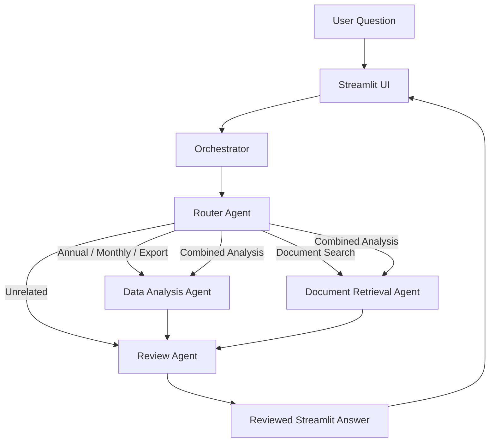
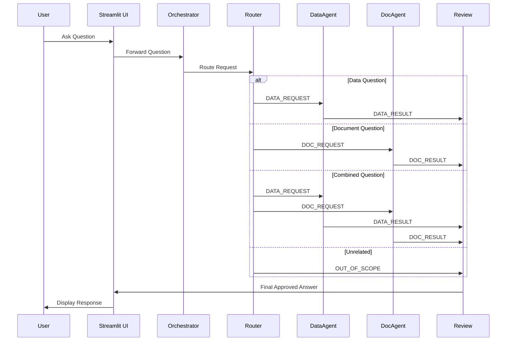

# Sri Lanka Tea Agent

Agentic AI Sri Lankan tea production and export analysis with official industry insight.

## Live Streamlit Demo

The deployed application is available at:

https://sri-lanka-tea-agentic-ai-2fadgytuwakqj95xp9jshb.streamlit.app/

## Project Overview

This project is an Agentic AI application developed for the IT41043 Intelligent Systems / Agentic AI assignment.

It analyses Sri Lankan tea production and export datasets and retrieves information from official Sri Lanka Tea Board documents.

The system combines:

- Structured CSV data analysis
- Retrieval-Augmented Generation (RAG)
- Multi-agent orchestration
- Reflection-based answer validation

The application is deployed using Streamlit Community Cloud.

## Problem

Tea production, export, sales, and official industry information is available across CSV datasets and many PDF reports. Manually searching and comparing these sources takes time.

This project provides one interface that can:

- Analyse annual tea production data
- Analyse monthly tea production data
- Compare years and months
- Analyse tea export volume and revenue
- Search official tea-industry documents
- Combine numerical analysis with official document explanations
- Review answers before displaying them
- Reject unrelated or unsupported questions

## Excluded Features

The system does not provide:

- Tea production predictions
- Live tea-auction prices
- Weather forecasting
- Tea-disease diagnosis
- Fertiliser recommendations
- Personal investment advice
- Real-time external data

## Agent Architecture

### High-level Flow



### Sequence Diagram



## Agents

### Router Agent

The Router Agent classifies each question as one of the following:

- `ANNUAL_PRODUCTION`
- `MONTHLY_PRODUCTION`
- `EXPORT_ANALYSIS`
- `DOCUMENT_SEARCH`
- `COMBINED_ANALYSIS`
- `UNRELATED`

It uses a fast routing model for structured classification.

### Data Analysis Agent

The Data Agent uses deterministic pandas functions to:

- Find highest and lowest annual production
- Compare annual production between two years
- Find highest and lowest production months
- Compare two months
- Calculate percentage changes
- Analyse export volume
- Analyse export revenue
- Produce table and chart data

All calculations are done using pandas to prevent hallucinated numerical results.

### Document Retrieval Agent

The Document Agent:

- Converts the question into an embedding
- Searches the FAISS vector index
- Retrieves relevant document chunks
- Includes document name, page number, and similarity score
- Uses the reasoning model to create a source-grounded draft answer

This follows a Retrieval-Augmented Generation (RAG) approach.

### Review Agent

The Review Agent checks:

- Whether numerical claims came from the datasets
- Whether document claims came from retrieved evidence
- Whether sources are included
- Whether unsupported information was added
- Whether the question is outside the project scope

The final answer is released only after validation.

## Agentic Design Patterns

1. **Router Pattern**
   - The Router Agent selects the correct specialist agent for each question.
2. **Tool-Use Pattern**
   - The Data Agent calls deterministic pandas analysis tools.
   - The Document Agent calls the FAISS retrieval tool.
3. **Orchestrator-Worker Pattern**
   - The Orchestrator sends structured tasks to the Router Agent, Data Agent, Document Agent, and Review Agent.
4. **Reflection Pattern**
   - The Review Agent checks grounding and evidence before the final answer is released.

## Agent-to-Agent Communication

The project uses a custom structured message protocol.

Example:

```json
{
  "sender": "Orchestrator",
  "receiver": "DataAgent",
  "message_type": "DATA_REQUEST",
  "payload": {
    "question": "Compare production in 2023 and 2024",
    "route": "ANNUAL_PRODUCTION"
  },
  "message_id": "uuid-12345",
  "timestamp_utc": "2026-07-29T10:15:00Z"
}
```

Every message includes:

- Sender
- Receiver
- Message type
- Payload
- Unique message ID
- UTC creation time

The Streamlit interface displays the full agent communication trace.

## Model Selection

| Sub-task | Model or Tool | Reason |
| --- | --- | --- |
| Routing | `openai/gpt-oss-20b on Groq` | Fast and suitable for structured classification |
| Document answer generation | `openai/gpt-oss-120b on Groq` | Better for document synthesis and reasoning |
| Final evidence review | `openai/gpt-oss-120b on Groq` | Better for checking complex evidence |
| Numerical calculations | `pandas` | Prevents the language model from inventing calculations |
| Embeddings | `sentence-transformers/all-MiniLM-L6-v2` | Small local semantic embedding model |
| Vector search | `FAISS IndexFlatIP` | Fast similarity search over document chunks |

Two different language models are deliberately used for different sub-tasks.

## RAG Pipeline

- Load official tea reports (PDF)
- Split documents into chunks
- Generate embeddings using sentence-transformers
- Store embeddings in FAISS
- Retrieve relevant chunks during user query
- Generate grounded answer using the reasoning model

Validate the answer using the Review Agent.

## Generated Files

```text
vector_store/tea_index.faiss
vector_store/tea_chunks.json
vector_store/index_metadata.json
```

## Dataset Files

```text
data/processed/tea_annual_production.csv
data/processed/tea_monthly_production_2025.csv
data/processed/tea_annual_exports.csv
```

## Document Collection

The project uses at least 20 official tea-industry PDF documents.

The document register is stored at:

```text
documents/document_register.csv
```

PDFs can be placed inside:

```text
documents/annual_reports/
documents/production_reports/
documents/export_reports/
```

## Local Installation

Create and activate a virtual environment:

```bash
python -m venv .venv
```

Windows Command Prompt:

```cmd
.venv\Scripts\activate
```

PowerShell:

```powershell
.\.venv\Scripts\Activate.ps1
```

Install libraries:

```bash
python -m pip install --upgrade pip
pip install -r requirements.txt
```

## API Key

Create:

```text
.streamlit/secrets.toml
```

Add:

```toml
GROQ_API_KEY = "your-key"

ROUTER_MODEL = "openai/gpt-oss-20b"
REASONING_MODEL = "openai/gpt-oss-120b"
EMBEDDING_MODEL = "sentence-transformers/all-MiniLM-L6-v2"
TOP_K = "5"
MINIMUM_SIMILARITY = "0.20"
```

This file must not be committed.

## Build the RAG Index

```bash
python -m src.rag.build_index
```

Generated files:

```text
vector_store/tea_index.faiss
vector_store/tea_chunks.json
vector_store/index_metadata.json
```

## Run Tests

```bash
pytest
```

## Run the Evaluation

```bash
python evaluation/run_evaluation.py
```

Then manually inspect:

```text
evaluation/rag_evaluation_results.csv
```

## Run the Streamlit Application

```bash
streamlit run app.py
```

## Streamlit Deployment

- Push the completed project to GitHub.
- Open Streamlit Community Cloud.
- Select the repository.
- Select the main branch.
- Set the main file as `app.py`.
- Open Advanced Settings.
- Paste the values from `secrets.toml` into the Secrets section.
- Deploy the application.

## RAG Evaluation

Five evaluation queries are stored in:

```text
evaluation/rag_evaluation_queries.json
```

The evaluation records:

- Expected document
- Top-one retrieved document
- Top-three document match
- Expected keyword coverage
- Manual answer-support result
- Notes

## Architecture Overview

The system uses a multi-agent architecture:

- Router Agent – Classifies user questions.
- Data Agent – Handles structured CSV analysis.
- Document Agent – Performs RAG-based retrieval.
- Review Agent – Validates answers before returning to the user.
- Orchestrator – Coordinates agent communication.

## Git Workflow

Feature branches used:

```text
feature/project-setup
feature/data-tools
feature/rag-pipeline
feature/agent-orchestration
feature/streamlit-ui
feature/model-router
feature/evaluation-readme
```

Each feature is developed on a separate branch, reviewed through a Pull Request, and merged into main.

Semantic commit message format is used:

```text
feat: New feature
fix: Bug fix
docs: Documentation updates
refactor: Code improvements
test: Testing improvements
```

At least 15 meaningful incremental commits are maintained.

The repository is public or shared with the lecturer as a collaborator.

## Known Limitations

- Results depend on the quality of PDF text extraction.
- Scanned image-only PDFs require OCR before indexing.
- The system only knows documents included in this repository.
- The numerical tools only analyse years and months included in the CSV files.
- Similarity scores show semantic relevance, not factual correctness.
- The application does not produce forecasts.
- The system does not use live external APIs.

## Academic Integrity

AI tools were used for code assistance and explanation.

However, the project architecture, datasets, document selection, implementation decisions, testing, evaluation, and final validation were completed and reviewed by the student.

## Declaration

By submitting this assignment, I confirm that:

- This work is my own original implementation.
- All external libraries, tools, and APIs used in this project are disclosed in this README.
- I understand the architecture and implementation details of this system.
- I am able to explain and modify any part of the code during a live viva or demonstration if required.

Student Name: Lishani Samarakoon  
Module: IT41043 – Intelligent Systems (Agentic AI)  
Institution: Horizon Campus

