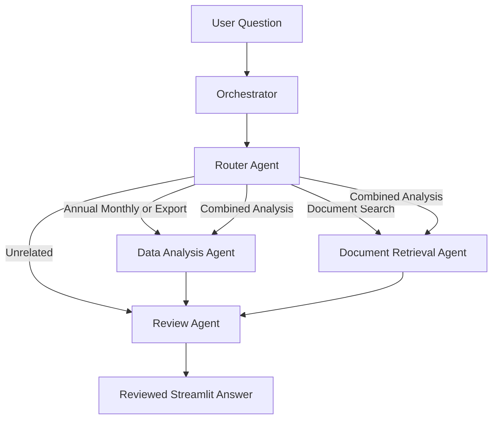

# Agentic AI Sri Lankan Tea Production and Export Analysis and Official Industry Insight Assistant

## Project Overview

This project is an Agentic AI application developed for the IT41043 Intelligent Systems / Agentic AI assignment.

The system analyses Sri Lankan tea-production and tea-export datasets and retrieves information from official Sri Lanka Tea Board documents.

The application is deployed using Streamlit Community Cloud.

## Problem

Tea-production, export, sales, and official industry information is available across CSV datasets and many PDF reports. Manually searching and comparing these sources takes time.

This project provides one interface that can:

- Analyse annual tea-production data.
- Analyse monthly tea-production data.
- Compare years and months.
- Analyse tea-export volume and revenue.
- Search official tea-industry documents.
- Combine numerical analysis with official document explanations.
- Review answers before displaying them.
- Reject unrelated or unsupported questions.

## Excluded Features

The system does not provide:

- Tea-production predictions.
- Live tea-auction prices.
- Weather forecasting.
- Tea-disease diagnosis.
- Fertiliser recommendations.
- Personal investment advice.

## Agent Architecture



## Agents

### Router Agent

The Router Agent classifies each question as:

- `ANNUAL_PRODUCTION`
- `MONTHLY_PRODUCTION`
- `EXPORT_ANALYSIS`
- `DOCUMENT_SEARCH`
- `COMBINED_ANALYSIS`
- `UNRELATED`

### Data Analysis Agent

The Data Agent uses deterministic pandas functions to:

- Find highest and lowest annual production.
- Compare annual production between two years.
- Find highest and lowest production months.
- Compare two months.
- Calculate percentage changes.
- Analyse export volume.
- Analyse export revenue.
- Produce table and chart data.

### Document Retrieval Agent

The Document Agent:

1. Converts the question into an embedding.
2. Searches the FAISS vector index.
3. Returns relevant document chunks.
4. Includes document name, page number, and similarity score.
5. Uses the reasoning model to create a source-grounded draft.

### Review Agent

The Review Agent checks:

- Whether numerical claims came from the datasets.
- Whether document claims came from retrieved evidence.
- Whether sources are included.
- Whether unsupported information was added.
- Whether the question is outside the project scope.

## Agentic Design Patterns

### 1. Router Pattern

The Router Agent selects the correct specialist agent for each question.

### 2. Tool-Use Pattern

The Data Agent calls deterministic pandas analysis tools. The Document Agent calls the FAISS retrieval tool.

### 3. Orchestrator-Worker Pattern

The Orchestrator sends structured tasks to the Router Agent, Data Agent, Document Agent, and Review Agent.

### 4. Reflection Pattern

The Review Agent checks grounding and evidence before the final answer is released.

## Agent-to-Agent Communication

The project uses a custom structured message protocol.

Example:

```json
{
  "sender": "Orchestrator",
  "receiver": "DataAgent",
  "message_type": "DATA_REQUEST",
  "payload": {
    "question": "Compare production in 2023 and 2024",
    "route": "ANNUAL_PRODUCTION"
  }
}
```

Every message includes:

- Sender.
- Receiver.
- Message type.
- Payload.
- Unique message ID.
- UTC creation time.

The Streamlit interface displays the full agent communication trace.

## Model Selection

| Sub-task | Model or Tool | Reason |
|---|---|---|
| Routing | `openai/gpt-oss-20b` on Groq | Fast and suitable for structured classification |
| Document answer generation | `openai/gpt-oss-120b` on Groq | Better for document synthesis and reasoning |
| Final evidence review | `openai/gpt-oss-120b` on Groq | Better for checking complex evidence |
| Numerical calculations | pandas | Prevents the language model from inventing calculations |
| Embeddings | `sentence-transformers/all-MiniLM-L6-v2` | Small local semantic embedding model |
| Vector search | FAISS `IndexFlatIP` | Fast similarity search over document chunks |

The two language models were deliberately selected for different sub-tasks.

## RAG Pipeline

1. Load official tea reports (PDF)
2. Split documents into chunks
3. Generate embeddings using sentence-transformers
4. Store embeddings in FAISS (in memory)
5. Retrieve relevant chunks during user query
6. Generate grounded answer using LLM

## Dataset Files

```text
data/processed/tea_annual_production.csv
data/processed/tea_monthly_production_2025.csv
data/processed/tea_annual_exports.csv
```

## Document Collection

The project uses at least 20 official tea-industry PDF documents.

The document register is stored at:

```text
documents/document_register.csv
```

PDFs can be placed inside:

```text
annual_reports/
documents/annual_reports/
documents/production_reports/
documents/export_reports/
```

## Local Installation

Create and activate a virtual environment:

```bash
python -m venv .venv
```

Windows Command Prompt:

```bash
.venv\Scripts\activate
```

PowerShell:

```powershell
.\.venv\Scripts\Activate.ps1
```

Install libraries:

```bash
python -m pip install --upgrade pip
pip install -r requirements.txt
```

## API Key

Create:

```text
.streamlit/secrets.toml
```

Add:

```toml
GROQ_API_KEY = "your-key"

ROUTER_MODEL = "openai/gpt-oss-20b"
REASONING_MODEL = "openai/gpt-oss-120b"
EMBEDDING_MODEL = "sentence-transformers/all-MiniLM-L6-v2"
TOP_K = "5"
MINIMUM_SIMILARITY = "0.20"
```

This file must not be committed.

## Build the RAG Index

```bash
python -m src.rag.build_index
```

Generated files:

```text
vector_store/tea_index.faiss
vector_store/tea_chunks.json
vector_store/index_metadata.json
```

## Run Tests

```bash
pytest
```

## Run the Evaluation

```bash
python evaluation/run_evaluation.py
```

Then manually inspect:

```text
evaluation/rag_evaluation_results.csv
```

## Run the Streamlit Application

```bash
streamlit run app.py
```

## Streamlit Deployment

1. Push the completed project to GitHub.
2. Open Streamlit Community Cloud.
3. Select the repository.
4. Select the `main` branch.
5. Set the main file as `app.py`.
6. Open Advanced Settings.
7. Paste the values from `secrets.toml` into the Secrets section.
8. Deploy the application.

## RAG Evaluation

Five evaluation queries are stored in:

```text
evaluation/rag_evaluation_queries.json
```

The evaluation records:

- Expected document.
- Top-one retrieved document.
- Top-three document match.
- Expected keyword coverage.
- Manual answer-support result.
- Notes.

## Known Limitations

- Results depend on the quality of PDF text extraction.
- Scanned image-only PDFs require OCR before indexing.
- The system only knows documents included in this repository.
- The numerical tools only analyse years and months included in the CSV files.
- Similarity scores show semantic relevance, not factual correctness.
- The application does not produce forecasts.

## Architecture Overview

The system uses a multi-agent architecture:

- Router Agent: Classifies user questions
- Data Agent: Handles structured CSV analysis
- Document Agent: Performs RAG-based retrieval
- Review Agent: Validates answers before returning to user

## Git Workflow

Feature branches used:

```text
feature/project-setup
feature/data-tools
feature/rag-pipeline
feature/agent-orchestration
feature/streamlit-ui
feature/evaluation-readme
```

Each feature is developed on a separate branch, reviewed through a Pull Request, and merged into `main`.

## Academic Integrity

AI tools were used for code assistance and explanation. The project architecture, datasets, document selection, testing, evaluation, implementation decisions, and modifications were completed and reviewed by the student.

